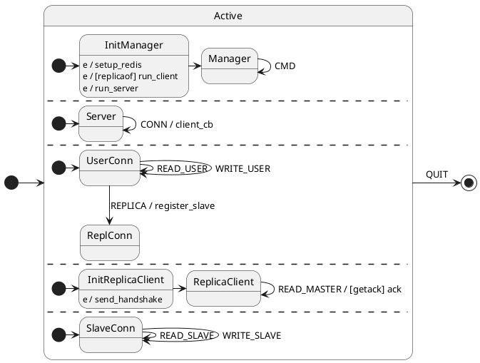

# Server architecture as SMs

```plantuml
@startuml

[*] -> Active

state Active {
[*] -> InitManager
InitManager : e / setup_redis
InitManager : e / [replicaof] run_client
InitManager : e / run_server
InitManager -> Manager
Manager -> Manager : CMD
--
[*] -> Server
Server -> Server : CONN / client_cb
--
[*] -> UserConn
UserConn --> ReplConn : REPLICA / register_slave
UserConn -> UserConn : READ_USER
UserConn -> UserConn : WRITE_USER
--
[*] -> InitReplicaClient
InitReplicaClient : e / send_handshake
InitReplicaClient -> ReplicaClient
ReplicaClient -> ReplicaClient : READ_MASTER / [getack] ack
--
[*] -> SlaveConn
SlaveConn -> SlaveConn : READ_SLAVE
SlaveConn -> SlaveConn : WRITE_SLAVE
}

Active -> [*] : QUIT

@enduml
```
