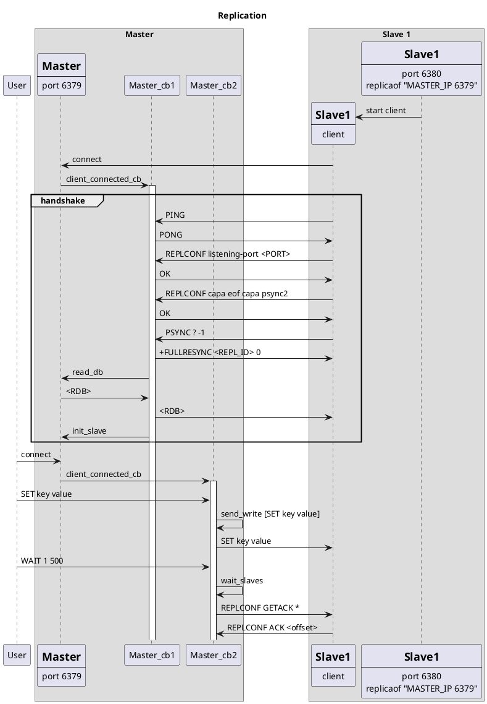

# Replication

Welcome to the Replication extension!

In this extension, you'll extend your Redis server to support leader-follower replication. You'll be able to run multiple Redis servers with one acting as the "master" and the others as "replicas". Changes made to the master will be automatically replicated to replicas.

